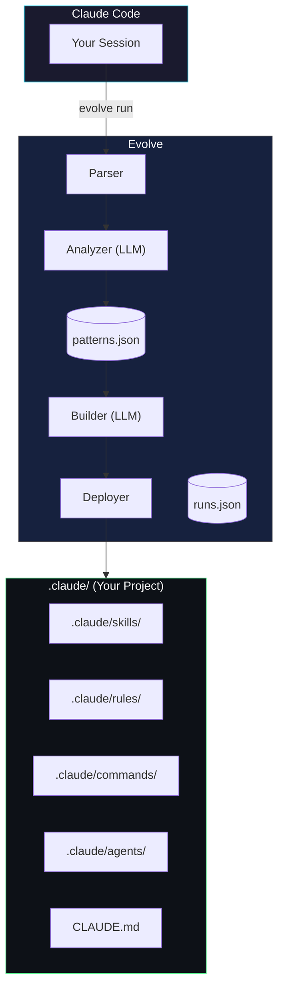
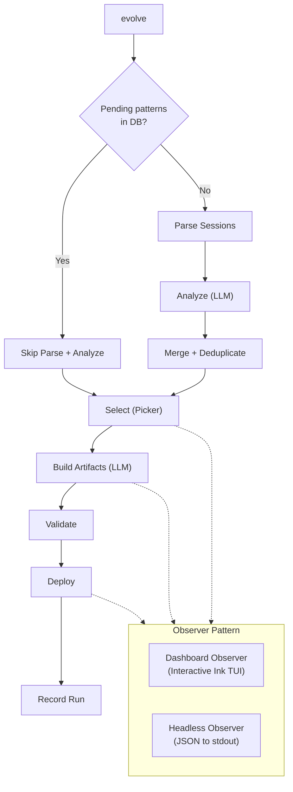
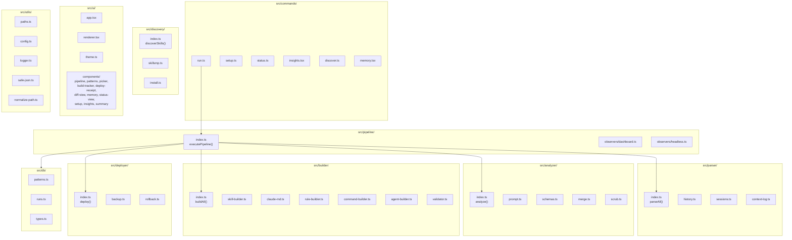
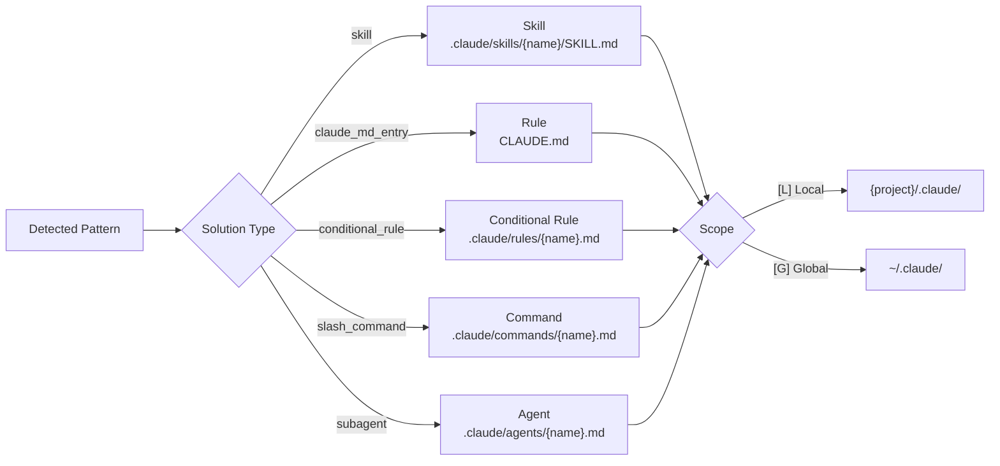
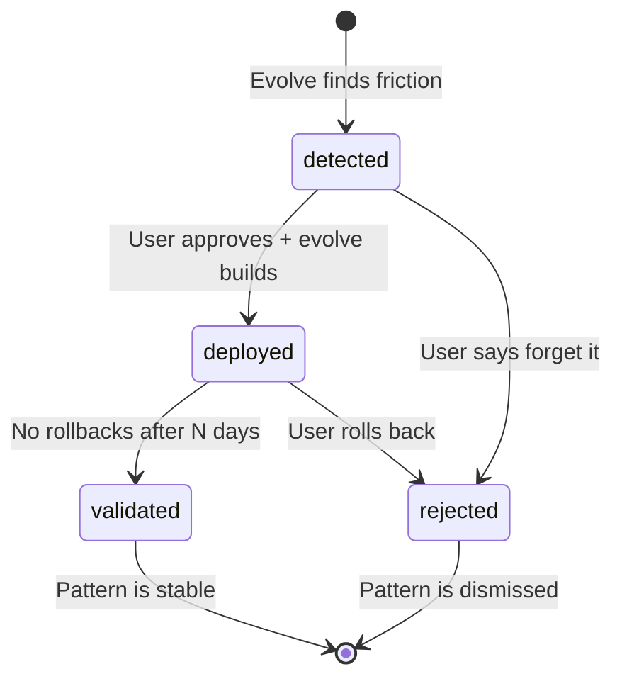
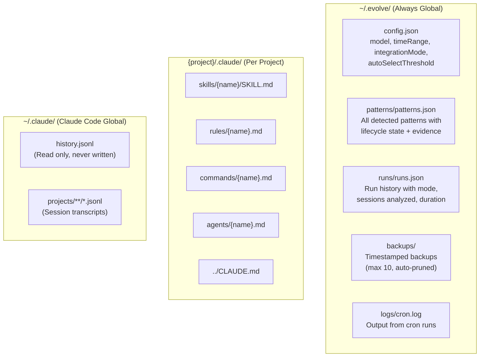
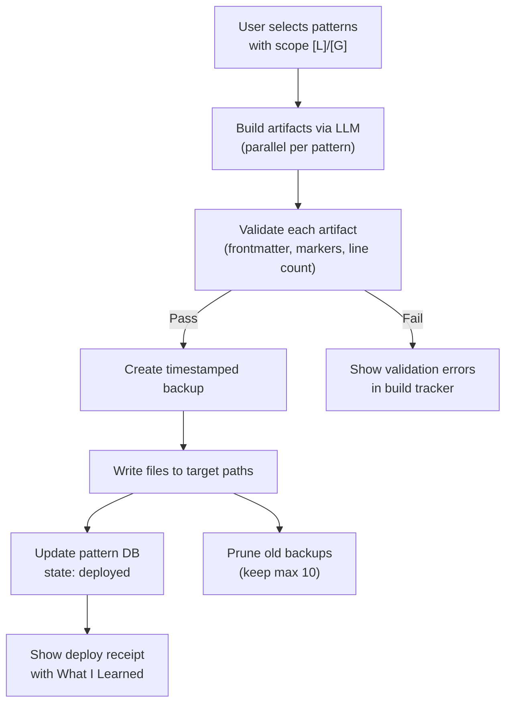
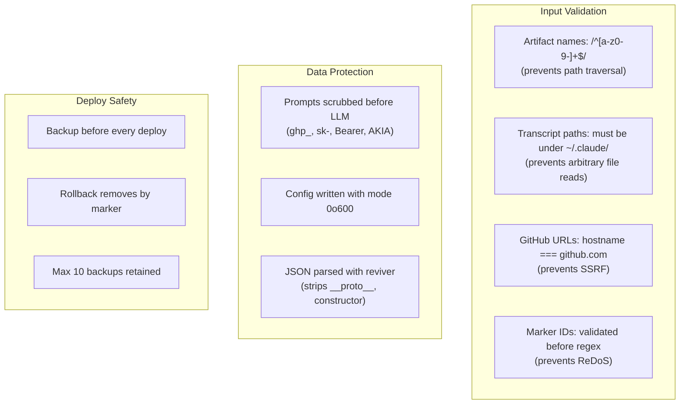
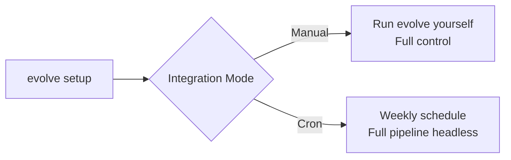

# Evolve - Architecture

## System Overview

## Pipeline Flow

When you run `evolve`, the pipeline executes through an observer pattern. Three observers handle different output modes.

## Module Structure

## Artifact Types

## Pattern Lifecycle

## Data Storage

Evolve uses flat JSON files. No database engine required.

## Deployment Flow

## Security

## Integration Modes

